#  Website  Login Automation

## The goal of this project is to create a script that will automate the login into a website using supplied credentials  and perform further functions such as clicking on the home menu:

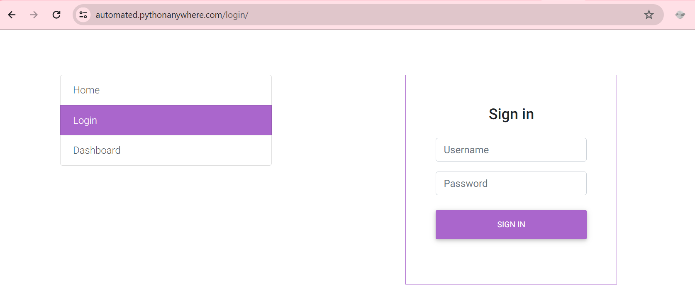

### By inspecting the elements of the username and password input boxes on the webpage; we use find_element by  id since the input elements has an id attribute. 
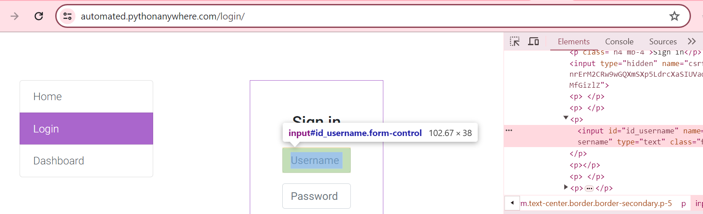
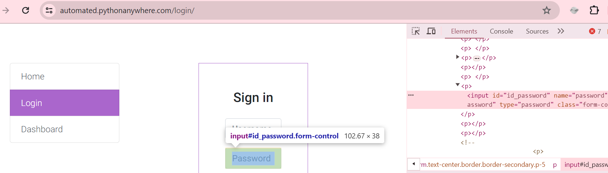
### Then write the script that uses the supplied credential to login to the page using the send.keys functions which expecting "automated" as username annd "automatedautomated" as the password.
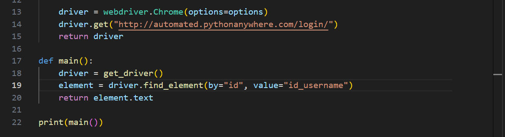
### To see the script in action, add a delay in between both actions with 2 seconds using the time module. Then import an object from selenium that helps to press enter from the key board using RETURN key
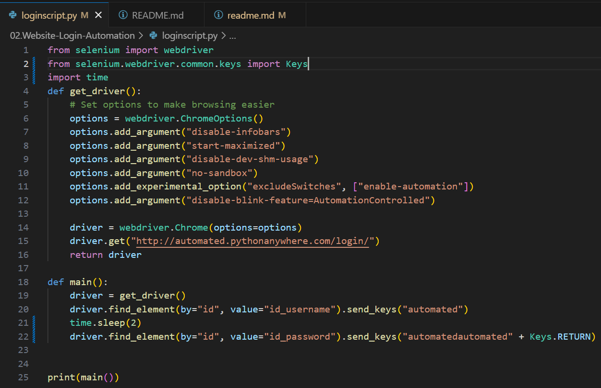

### Action
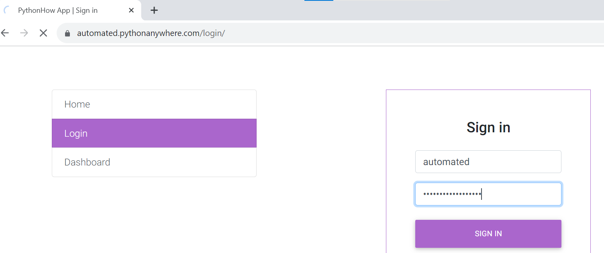
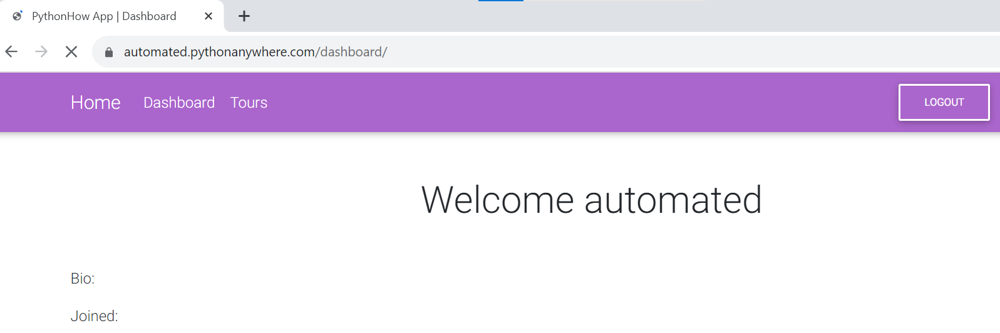
### Next is to perform other functions after login like clicking on the Home menu for insntance. To do this, we use the xpath of the home menu. Also we want to scrap the dynamic figure of the average world temporature:
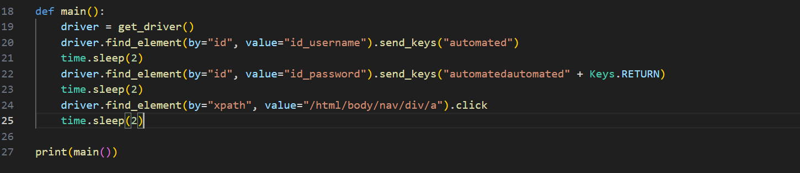
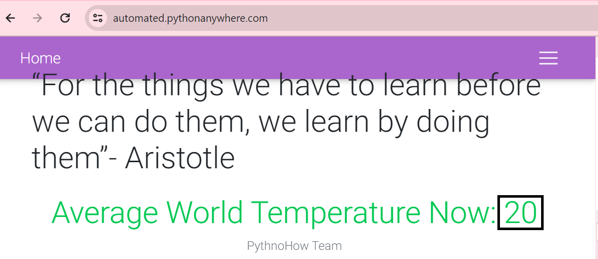
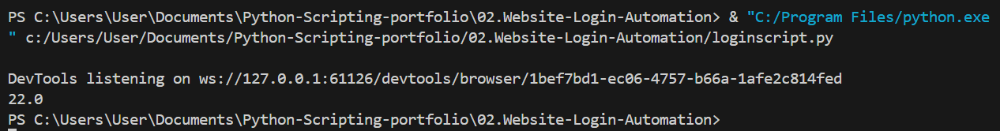

### Futher step would be to extract and save the temperature into generated files every two seconds.  We use a loop and modify the script accordingly to extract the values to a text file with the name of the file as the date and time the values that are saved.   
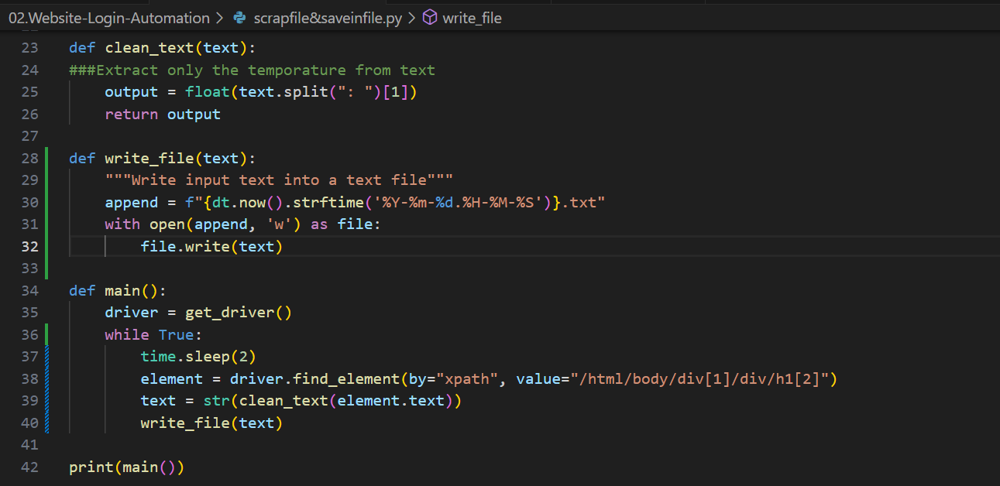
### Action
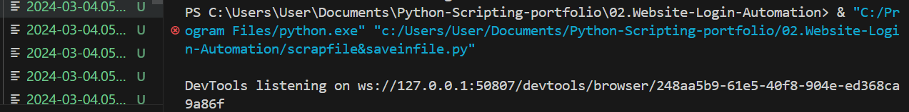

## Another Login Automation Example
### Here we create an account on a retailer website and creat a script that login and click on the contact us menu

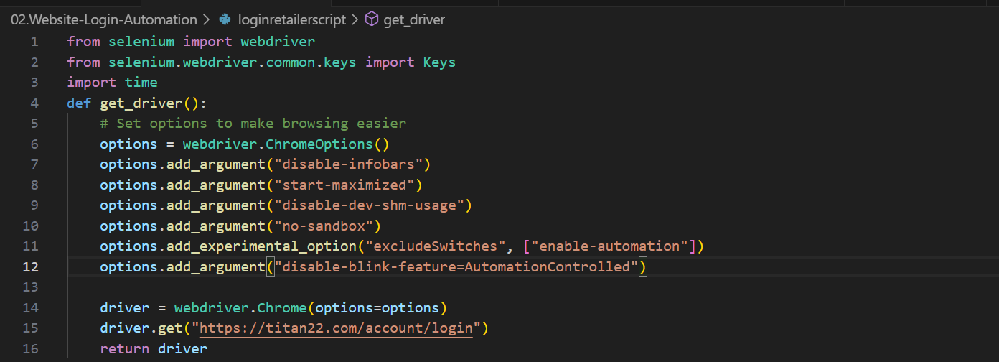
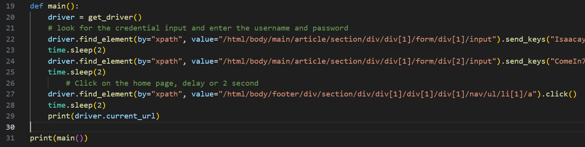

### Action
[Click to watch - Video of Runing Script](https://drive.google.com/file/d/1AEf8WZoZ9Lfm1HO4Az9eIbGdVofLVXbX/view?usp=sharing)
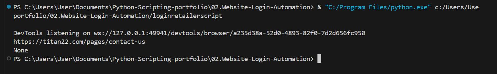

## Futher Automation Example - Extracting Real-Time currency rates
### From x-rates we scrap real-time currency rates between two pair of currencies. The manual approach is to go to the currency calculator on the website and type in the desired currency pair to see the current rate. By observing  url changes we able to set appropriate url attributes. Then we can use beatiful soup library to scrap the rates directly. 
```
If you dont have it already, you can install beatiful soup using: >pip install beautifulsoup4
```
#### First we construct the url for dynamic currency rates and run it to test that it working
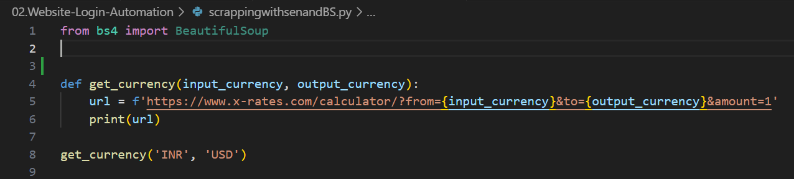
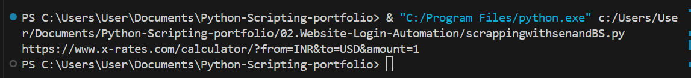

### Then access the source code of the page using request
```
If you dont have it already, you can install request using: >pip install request
```

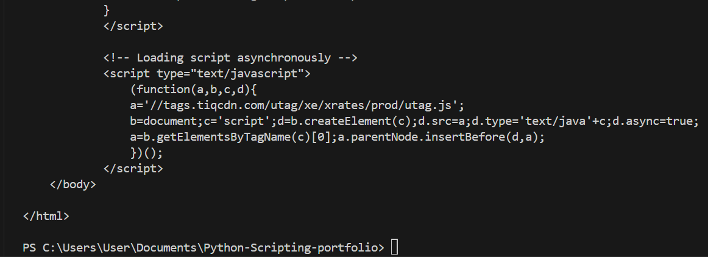

