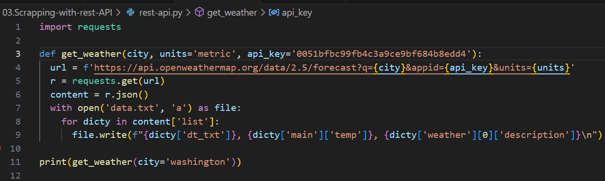
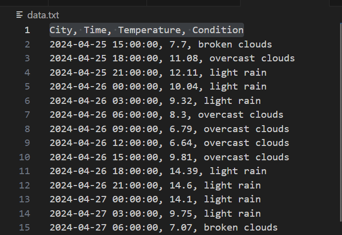

#  Information Scrapping with REST API

## The goal of this project is to create scripts that will scrap information from websites with REST API

## Step
#### Goto Openweathermap.org and click on the API menu, scroll down to the 5 Day / 3 Hour Forecast and select a free plan, then create a account  to get access the API key 
### Write the Pyton Script

#### The Script generates weather forecast data such as City, Time, Temperature, and Condition for Washington accordingly and save it into the  data.txt file.
