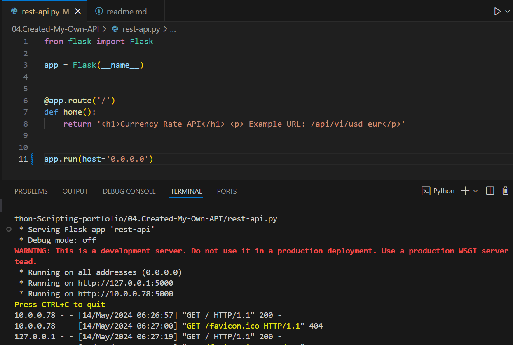

#  Currency Converter API

## The goal of this project is to create a rest API that return the current currency Pair in real time.

## Step
#### API as a small web app, We use one of Python frameworks such as flasks and later deploy it on python anywhere or heroku or others in order to make it publicly accessible. If you dont have flask installed, Use Pip install flask!

#### The Script generates weather forecast data such as City, Time, Temperature, and Condition for Washington accordingly and save it into the  data.txt file.

